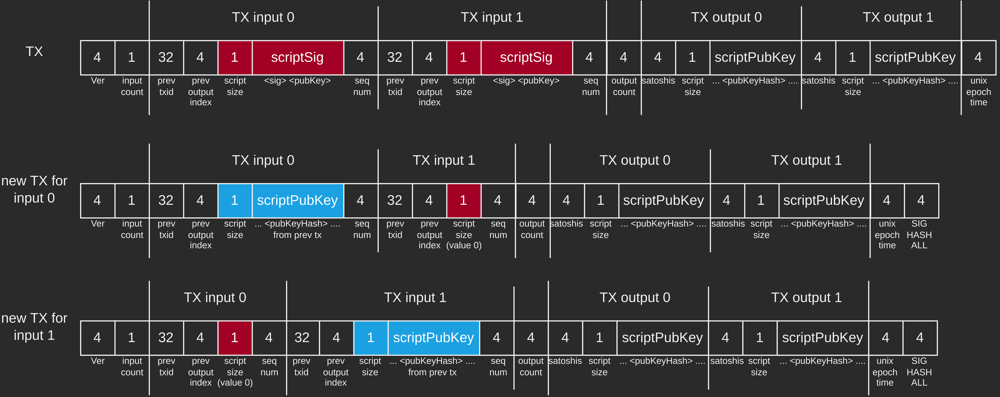

# Bitcoin Pay-to-PubkeyHash (P2PKH) transactions verifier for Cryptography course at UniMi

This is a Python command line program that verifies Bitcoin's Pay-to-PubkeyHash (P2PKH) transactions.

## Usage
```
pip install -r requirements.txt
python3 tx_verify.py -h
```
```
usage: tx_verify.py [-h] -t TXID

Bitcoin Pay-to-PubkeyHash (P2PKH) transactions verifier for Cryptography Course at UniMi

options:
  -h, --help            show this help message and exit
  -t TXID, --txid TXID  The ID of the transaction to verify
```

## How raw transactions are composed
Given this raw transaction example:
```
010000000190df970d7f7f2881258da9dbf6205f85839a2eb8ec88298e5db313fc2a239377000000006b483045022100e384d96b1b12df38f3f8fcf606e4b7a4e2f5f65c6b724af26291bd0de188191b0220249fac61c20f564ac89f06fe7502270820e694299d0d2e28dcc188089901eb9c01210369e03e2c91f0badec46c9c903d9e9edae67c167b9ef9b550356ee791c9a40896ffffffff02a1a29602000000001976a9149f21a07a0c7c3cf65a51f586051395762267cdaf88aca09e3900000000001976a91402f9d6bafab13b2bbd68d1dc380f3f8bbddc3dc388ac00000000
```
It is composed by:
- version: 4 bytes
  - `01 00 00 00`
- input count: 1 bytes
  - `01`

Inputs section:
- previous tx id (little endian form): 32 bytes
  - `90df970d7f7f2881258da9dbf6205f85839a2eb8ec88298e5db313fc2a239377`
- previous output index: 4 bytes
  - `00 00 00 00`
- script (composed by `<sig> <pubkey>`) length: 1 byte
  - `6b` (which is 107 bytes)
- `<sig>` length: 1 byte
  - `48` (which is 72 bytes)
- DER signature marker: 1 byte
  - `30`
- signature length: 1 byte
  - `45` (which is 69 bytes)
- r value marker: 1 byte
  - `02`
- r value length: 1 byte
  - `21` (which is 33 bytes)
- r value: 33 bytes
  - `00e384d96b1b12df38f3f8fcf606e4b7a4e2f5f65c6b724af26291bd0de188191b`
- s value marker: 1 byte
  - `02`
- s value length: 1 byte
  - `20` (which is 32 bytes)
- s value: 32 bytes
  - `249fac61c20f564ac89f06fe7502270820e694299d0d2e28dcc188089901eb9c`

The `signature` is `R + S` without `00` in `R`
```
e384d96b1b12df38f3f8fcf606e4b7a4e2f5f65c6b724af26291bd0de188191b249fac61c20f564ac89f06fe7502270820e694299d0d2e28dcc188089901eb9c
```
- sighash flag, if = `01` then the signature applies to all the inputs and the outputs, this is the most common for P2PKH transactions
  - `01` 
- `<pubKey>` length: 1 byte
  - `21` (which is 33 bytes)

The public key is:
```
0369e03e2c91f0badec46c9c903d9e9edae67c167b9ef9b550356ee791c9a40896
```
- sequence number: 4 bytes
  - `ffffffff` (which is the default value)

Outputs section:
- output count: 1 byte
  - `02`
- number of satoshis to spend (output #1): 8 bytes
  - `a1a2960200000000`
- pubkey script length (output #1): 1 byte
  - `19`(which is 25 bytes)
- pubkey script (output #1): 25 bytes
  - `76a9149f21a07a0c7c3cf65a51f586051395762267cdaf88ac`
- number of satoshis to spend (output #2): 8 bytes
  - `a09e390000000000`
- pubkey script length (output #2): 1 byte
  - `19`(which is 25 bytes)
- pubkey script (output #2): 25 bytes
  - `76a91402f9d6bafab13b2bbd68d1dc380f3f8bbddc3dc388ac`
- unix epoch time or block number: 4 bytes
  - `00000000`


## How to verify a transaction
A transaction is verified if all inputs are verified.

To verify an input we have to check if the hash of the public key and the public key hash in the corresponding ouput of the previous transaction are equal. To do this we get the previous transaction from the `previous txid` we got earlier and extract the output corresponding to the `previous output index`.

### From the output number zero of the previous transaction
pubKey script
```
76a9149f21a07a0c7c3cf65a51f586051395762267cdaf88ac
```
where:
- OP_DUP: 1 byte
  - `76`
- OP_HASH160: 1 byte
  - `a9`
- pubkey hash size: 1 byte
  - `14` (which is 20 bytes)
- pubKey hash
  - `9f21a07a0c7c3cf65a51f586051395762267cdaf`
- OP_EQUALVERIFY: 1 byte
  - `88`
- OP_CHECKSIG: 1 byte
  - `ac`

Now we calculate the Hash160 of the `<pubKey>` and check if it is equal to `<pubKeyHash>`.

Then we have to build a new transaction from which the signature `<sig>` is calculated following this schema and appending `01 00 00 00` which is `SIGHASH_ALL`.

This is an example with more than one input. If there is only one input then completely skip the `TX input 1` part.



We have to replace the `scriptSig` of the original transaction with the previous `scriptPubKey` (length included) if the input is the one we have to verify, else we replace the `scriptSig` with just the length byte set at `00`.

Finally, we calculate the SHA-256 of the new transaction, then hash it again to verify the signature using `<sig>` and `<pubKey>`.

Repeat for every input.